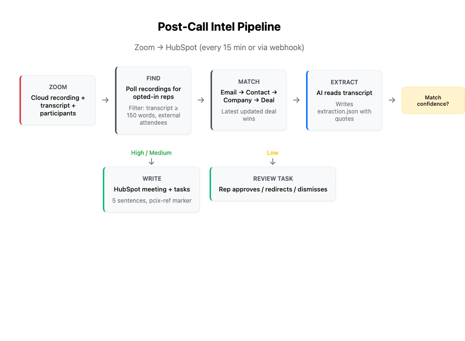

# post-call-hubspot (Hermes skill)

Zoom call transcripts -> verified, short HubSpot deal notes + tasks. One shared pipeline for all reps
(no agent or profile per rep). Zoom and HubSpot only.



## What this skill enables

After a rep finishes a recorded Zoom call, this skill finds the right HubSpot opportunity, adds a short summary of what happened (five sentences at most) as a HubSpot meeting on that deal, and creates tasks for the rep's own follow-ups. The rep does nothing. If the skill is not sure which deal the call belongs to, it writes nothing to a deal and instead asks the rep with a single HubSpot task. The whole cycle runs every 15 minutes via cron (or optionally via a Zoom webhook). The AI is involved only for extraction.

### Workflow

1. **Find** (code) — lists recent recordings for each opted-in rep, keeps those with a transcript of at least 150 words, and gets attendee emails from Zoom's participants data (not from the transcript text).
2. **Match** (code) — drops your own company's attendees, looks up the external attendee in HubSpot, finds their company, then lists that company's deals. If there is more than one deal, the most recently updated one is used (closed deals included).
3. **Extract** (agent) — reads the transcript and writes one file: up to 5 note sentences, objections, timeline signals, next steps, contact roles and sentiment. Every item needs a word-for-word quote and a confidence level.
4. **Verify** (code) — checks each quote against the real transcript. Drops anything not found, anything low-confidence, and anything containing links or HTML. Trims the note to 5 sentences.
5. **Write** (code) — high or medium match: creates the HubSpot meeting on the deal plus tasks for your team's next steps. Low match: creates a review task for the rep instead. Deletes the transcript text immediately.

### Matching confidence

|| Confidence | When | Result |
||---|---|---|
|| **High** | An external attendee's email matches a HubSpot contact, with a single company and an eligible deal | Written to the deal automatically |
|| **Medium** | Match by email domain only, a contact with no company, or several companies with a clear majority | Written to the deal; footer flags the match level |
|| **Low** | A tie between companies, a topic-only guess, no eligible deal, or no external attendee emails | Nothing written to a deal. Review task created for the rep |

Internal-only meetings and very short transcripts are skipped silently.

### What lands in HubSpot

A HubSpot meeting (or note) on the right deal, up to 3 tasks, and a rep-ready summary of what was and was not written. The default object is a **meeting**; a note is one setting away (`write_as: note`). Each entry carries a `pcix-ref:<Zoom meeting id>` footer that is metadata, not prose. Tasks are created only for your team's commitments (not the customer's), assigned to the host rep, associated to the deal, with a short title and one-line body.

#### The review task (when the match is uncertain)

The rep gets a task titled `[Call Intel Review] ...` showing the suggested deal and the proposed note. Three options:

- **Approve** — mark the task complete. The next cycle writes the meeting to the suggested deal.
- **Redirect** — edit the `DEAL_ID:` line to the correct deal, then complete the task.
- **Dismiss** — put `DISMISS` on its own line, then complete (or delete) the task.

Tasks expire after 14 days.

### Safety and quality guarantees

|| Guarantee | How it is enforced |
||---|---|
|| Right record, or no record | Low-confidence matches never write. They go to a review task. |
|| Nothing invented | Every written claim carries a verbatim quote that code verifies against the transcript. Unverifiable items are dropped and listed as withheld. |
|| Deal properties are untouchable | The code can only create meetings, notes and tasks. No function exists to change stage, amount or any record property, even if someone on the call tries to instruct the AI. |
|| Spoken instructions are ignored | The transcript is fenced as untrusted data, and the AI step has no HubSpot or Zoom tools. Links and HTML are rejected. |
|| Five sentences, always | A sentence counter in code trims the body (strict: when unsure it counts more sentences, not fewer). |
|| No duplicates | Each entry carries a marker checked in HubSpot before writing, so retries, restarts and lost local state never double-post. |
|| Only opted-in reps | The Zoom credential is account-wide, so a default-deny rep list limits which recordings are ever read. |

## Setup

### 1. Install
Everything lives in one folder: `~/.hermes/skills/post-call-hubspot/`
```bash
unzip post-call-hubspot.zip -d ~/.hermes/skills/        # creates ~/.hermes/skills/post-call-hubspot/
cd ~/.hermes/skills/post-call-hubspot
pip install -r requirements.txt                          # PyYAML only
cp config/settings.example.yaml config/settings.yaml     # then edit
```
Python 3.9+. No other dependencies. Runtime files (work items, `state.db`) are created under `data/` inside
that folder. `config/settings.yaml` and `data/` are local only; do not commit them.

### 2. Zoom (admin, once)
Create a **Server-to-Server OAuth** app (Zoom App Marketplace > Develop > Build App). One app covers all reps.

**Scopes (Scopes tab, granular, the `:admin` variants that S2S apps use):**
| Scope | Used for |
|---|---|
| `cloud_recording:read:list_user_recordings:admin` | list each opted-in rep's cloud recordings |
| `cloud_recording:read:list_recording_files:admin` | get a meeting's recording files (webhook-queued meetings) |
| `meeting:read:list_past_participants:admin` | attendee emails for matching |

**Also required in Zoom (not scopes):**
- The admin who creates the app needs a role with **"Server-to-server Auth app"** and **"View the recording and transcript content"** permissions.
- Plan: **Pro or higher**. Cloud recording and **Audio transcript** must be enabled for each rep
  (Settings > Recording). No transcript file = nothing to process.
- Webhook (optional): add the *Recording Transcript Completed* event under Feature > Event Subscriptions and
  copy the Secret Token to `ZOOM_WEBHOOK_SECRET_TOKEN`.

### 3. HubSpot (super admin, once)
Create a **Private App** (Settings > Integrations > Private Apps; requires super admin).

| Scope | Used for |
|---|---|
| `crm.objects.contacts.read`, `crm.objects.companies.read`, `crm.objects.deals.read` | find contact -> company -> deals |
| `crm.objects.owners.read` | map the host rep to a HubSpot owner |
| `crm.objects.notes.read`, `crm.objects.meetings.read`, `crm.objects.tasks.read` | dedupe marker, call numbering, review tasks |
| **`crm.objects.meetings.write`**, **`crm.objects.tasks.write`** | create the call meeting + tasks (default `write_as: meeting`) |
| `crm.objects.notes.write` | only if you set `write_as: note` |

**Least privilege vs. fallback.** Prefer the specific `*.meetings/tasks/notes.write` scopes above: they let the
token create activities but not edit your deals or contacts. If your scope picker doesn't offer them, the
commonly documented fallback is `crm.objects.contacts.write` + `crm.objects.deals.write`. That works, but it
is broader than this skill needs (the token could then edit deals), so the code-level write allowlist becomes
the only guard. If a write ever returns `403 MISSING_SCOPES`, HubSpot's error names the scope to add.

**Verify:** `python3 scripts/pcix.py doctor` reads your token's granted scopes (HubSpot's access-token-info
endpoint), compares them with this table, and probes read access to every object we use. Write access can only be
proven by a real write: after `doctor`, run one low-risk real cycle with a single test rep.

### 4. Secrets (environment variables; never in the config file)
```
HUBSPOT_TOKEN=...
ZOOM_ACCOUNT_ID=...  ZOOM_CLIENT_ID=...  ZOOM_CLIENT_SECRET=...
ZOOM_WEBHOOK_SECRET_TOKEN=...      # only if you run the webhook receiver
```

### 5. Configure + verify
Edit `config/settings.yaml`: `internal_domains`, `reps` (default-deny: only listed reps' meetings are read),
`write_as` (default `meeting`). Then:
```bash
python3 scripts/pcix.py doctor              # config, Zoom token, HubSpot reads, owner per rep
python3 scripts/pcix.py prepare --dry-run   # see what would be matched; no writes
```
Run the unit tests any time: `python3 -m unittest discover -s tests`.

### 6. Schedule it
```bash
hermes cron create "every 15 minutes" "Run one cycle of the post-call-hubspot skill." \
  --name post-call-intel --deliver local --skill post-call-hubspot
```
(Flags are the ones used in the original repo; adjust to your Hermes version. One job for everyone.)

### 7. Optional: Zoom webhook for near-real-time
`python3 scripts/pcix.py webhook` listens on `webhook.host:port/path`, verifies Zoom's signature, and queues the
meeting. Expose it over HTTPS (reverse proxy), subscribe the Zoom app to the *recording transcript completed*
event, and set `webhook.trigger_command` to a command that runs one skill cycle (or just keep the cron as the
trigger; a queued meeting is picked up on the next cycle). Polling still runs, so a missed webhook costs nothing.

## Reps' daily experience
Nothing. Notes appear on the deal. If the match was uncertain they get one HubSpot task:
**complete it** to approve the suggested deal, **edit the `DEAL_ID:` line** first to choose another, or put
**`DISMISS`** on its own line to drop it. Review tasks expire after 14 days.

## Rules worth knowing
- **Client with several opportunities -> the most recently updated one** (`hs_lastmodifieddate`), closed deals
  included. To ignore closed deals when choosing, set `deal_selection.include_closed: false`.
- **Meeting (default) or note bodies <= 5 sentences** of prose, plus a one-line footer (date, call #, match confidence,
  `pcix-ref` marker) that is metadata, not prose. Tasks: short title, one-line body, only for *our* next steps.
- Call number = how many calls this skill already logged on that deal + 1. Backfill by raising
  `lookback_hours` before the first run; meetings are processed oldest first.
- Known limits: guests who join Zoom without signing in have no email, so they can't be matched by email
  (the call falls back to topic matching = review task). If the note is created but a task creation fails,
  tasks are not retried (the error is shown in the output).

## Data retention and access (recommended defaults, all configurable)
| Data | Where | Default |
|---|---|---|
| Transcript text (`transcript.txt`) | `data/work/<id>/` | **Deleted immediately** after the call is written/skipped/sent to review |
| `context.json` + `extraction.json` (attendee emails, short quotes) | `data/work/<id>/` | Deleted **7 days** after the call is finished (`retention_days`) |
| `state.db` (ids, statuses, proposed review text) | `data/state.db` | Rows deleted after **90 days** (`state_retention_days`); open reviews kept |
| The recording + transcript itself | Zoom | Governed by Zoom retention: set Zoom's own auto-delete to match your policy |
| What reaches HubSpot | CRM | <= 5 sentences + short tasks, under HubSpot's normal permissions |

`prepare` purges automatically each cycle; run `python3 scripts/pcix.py purge` (or `--dry-run`) manually any time.
Everything the skill creates is owner-only (umask 077).

**Who should have access to the host:** run it on a dedicated machine/VM or service account, limited to 2-3 named
Sales Ops/IT admins; full-disk encryption on; keep `data/` out of backups and git; keep secrets in environment
variables or a secret manager (not in `settings.yaml`, not in shell history); rotate the HubSpot and Zoom
credentials if an admin leaves.

## Files
`SKILL.md` agent instructions | `prompts/extract.md` extraction prompt | `scripts/` CLI + library |
`config/settings.example.yaml` | `examples/` sample transcripts + expected output | `tests/` | `PRD.md` | `docs/post-call-hubspot-overview.pdf` (plain-language overview)

Not verified against live accounts: this package was tested with in-memory fakes of the Zoom and HubSpot APIs,
not live endpoints. Run `doctor` and a `--dry-run` cycle before enabling the cron.
